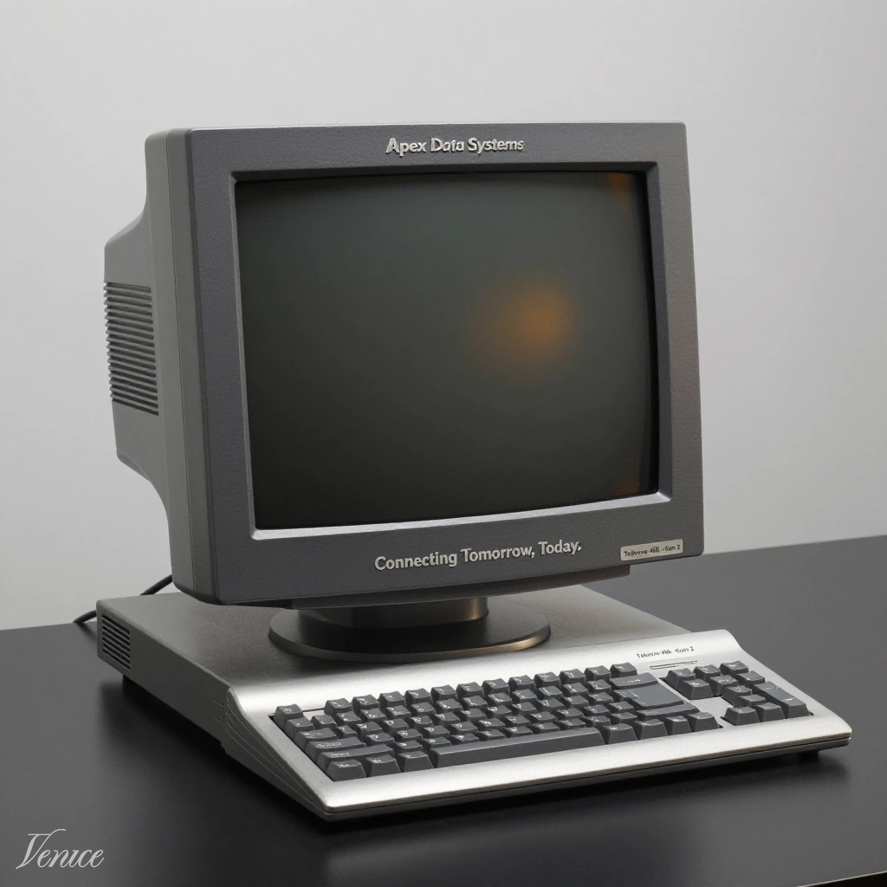
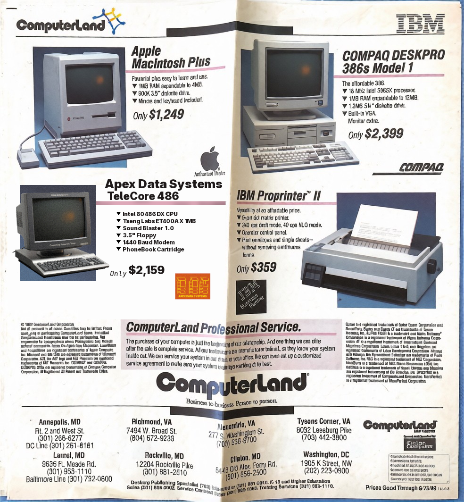

# TeleCore

A custom [MiSTer FPGA](https://misterfpga.org/) core that recreates a fictional
late-1980s dedicated BBS terminal appliance — the **TeleCore 486** by
*Apex Data Systems* (Hill Valley, California, est. 1987).

> *Connecting Tomorrow, Today.*

TeleCore is not a general-purpose PC core. It is a "dumb terminal" machine that
boots straight into a terminal program and dials out to BBS systems over COM1
(the serial/modem port).

## Hardware

- **CPU:** Intel 80486DX
- **Video:** Tseng Labs ET4000AX-compatible VGA, 1 MB, 80x25 text
- **Audio:** Sound Blaster 1.0 + game port (in progress), PC speaker
- **Input:** PS/2 keyboard and mouse
- **Storage:** 1.44 MB floppy A: (82077)
- **Modem:** COM1 (3F8h, IRQ4) — 9600 8N1 default
- **RTC:** MC146818 with Y2K-aware date/time setup
- **PhoneBook cartridge:** swappable `.pbk` image holding BBS names and dial-up
  addresses, editable in the BIOS

## BIOS features

- Apex Data Systems ASCII boot logo and 5-second boot menu
- **F2** — Setup: field-based date/time editor (type digits or `+`/`-`,
  12-hour clock with AM/PM, Y2K-safe years). `F10` saves to CMOS, `Esc` cancels.
- **F3** — PhoneBook: browse, dial, add, edit and delete BBS entries.
  `S` saves the cartridge, `F9` formats it (with confirmation and a
  0–100% progress display).
- `READY>` prompt fallback when no terminal ROM is installed — typed characters
  go to COM1 and received data is displayed.

## MiSTer OSD slots

| Slot | Type | Purpose |
|------|------|---------|
| S0 | `.nvr` | Settings NVRAM (`settings.nvr`) — battery-backed CMOS |
| S1 | floppy | A: drive image |
| S2 | `.pbk` | PhoneBook cartridge (`phonebook.pbk`) |

Mounted files are remembered by the MiSTer "Save Settings" OSD option.
BIOS CMOS writes are written back into `settings.nvr` when it is mounted.

## Installing / updating on the MiSTer

Download `telecore-release.zip` from the
[latest release](../../releases/latest) and either:

- run `update_TeleCore.sh` on the MiSTer (Scripts menu) — it downloads and
  installs the latest release automatically, or
- copy the zip to the MiSTer and run
  `update_TeleCore.sh /path/to/telecore-release.zip`.

The updater installs:

- `TeleCore.rbf` → `/media/fat/_TeleCore/`
- `boot0.rom`, `boot1.rom`, `addon.rom`, `fallback.hex`,
  `phonebook.pbk`, `settings.nvr` → `/media/fat/games/TeleCore/`

From a PC with the repo checked out and a built `.rbf` in `output_files/`,
`tools/install.sh mister` pushes the core over SSH.

## Building

| Target | Command |
|--------|---------|
| BIOS ROMs | `./tools/build_bios.sh` (needs `nasm`, `python3`) |
| FPGA core | `tools/build_core.sh` (Quartus 17.0, e.g. `raetro/quartus:17.0` Docker image) |
| PhoneBook image | `python3 tools/mkphonebook.py -i games/phonebook.json -o games/phonebook.pbk` |
| Settings image | `python3 tools/mksettings.py -o games/settings.nvr` |

GitHub Actions workflows build each piece on push (`.github/workflows/`), and
pushing a `v*` tag builds the whole package and attaches `telecore-release.zip`
to a GitHub Release.

## PhoneBook format

`phonebook.pbk` is a 64 KB cartridge image: 32-byte `TCPB` header followed by
128-byte records (name, address, protocol, flags, baud). Edit
`games/phonebook.json` and rebuild with `tools/mkphonebook.py`, or edit entries
directly in the BIOS PhoneBook menu.
